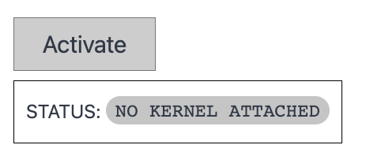

This guide is for people looking to add quickly `thebe` and `thebe-lite` to a **static HTML website** for in-browser jupyterlite powered WASM computation. It's not just for static HTML, you can also follow this to add `thebe` to any website where you can add script tags to the `<head>` and target code on your page using a stable css selector.

Let's get started! 🚀

```{tip} Using thebe-lite in React
:class: dropdown
If you are using the `thebe-react` providers and hooks and want to add `thebe-lite` into your app, see the [`thebe-react` specific docs here](react-lite.md).
```

## Loading scripts, styles & configuration

Add the following to the `<head>` section of your HTML:

```{code-block} xml
:linenos:
<script
  type="text/javascript"
  src="https://unpkg.com/thebe-lite@latest/dist/lib/thebe-lite.min.js"
></script>
<script type="text/javascript" src="https://unpkg.com/thebe@rc/lib/index.js"></script>
<link rel="stylesheet" href="https://unpkg.com/thebe@thebe@rc/lib/thebe.css" />
```

This will:

- Load the latest javascipt bundle for `thebe-lite`.
- Load the javascript bundle for the latest Release Candidate version of `thebe`.
- Load the styles for the same version, including the styles you'll need for rendering Juptyer outputs and ipywidgets properly.

## Configure `thebe` to use JupyterLite

Enable the in-browser JupyterLite server by adding the follow configuration script to the `<head>` of your webpage:

```{code-block} xml
:linenos:
:emphasize-lines: 4
<script type="text/x-thebe-config">
  {
      useBinder: false,
      useJuptyerLite: true,
  }
</script>
```

`thebe-lite` is currently limited to using the `pyodide` kernel. By default, `thebe-lite` will look for python (WASM) wheels (`.whl`) on relative paths, meaning you have to take care to also deploy them and ensure they are reachable on the expected url paths (more on that in [`thebe-lite` options](./lite-options.md)).

But we can avoid that by overriding some JuptyerLite settings directly, and load the wheels from CDN. This makes inital setup much easier!

Do this by adding an additional `script` to the `<head>` of your page:

```{code-block} xml
:linenos:
<script id="jupyter-config-data" type="application/json">
  {
    "litePluginSettings": {
      "@jupyterlite/pyodide-kernel-extension:kernel": {
        "pipliteUrls": ["https://unpkg.com/@jupyterlite/pyodide-kernel@0.0.7/pypi/all.json"],
        "pipliteWheelUrl": "https://unpkg.com/@jupyterlite/pyodide-kernel@0.0.7/pypi/piplite-0.0.7-py3-none-any.whl"
      }
    },
    "enableMemoryStorage": true,
    "settingsStorageDrivers": ["memoryStorageDriver"]
  }
</script>
```

Note due to the namin convention of the `piplite` wheel, it's necessary to keep this updated to the latest version manually.

## Add some UI elements

Thebe provides some default UI componponents that can be customixed via css. To add these components to your page add the following `html` elements in desired location.
Add at least the first element to have a way to activate`thebe`.

```{code-block} xml
<‍div class="thebe-activate"><‍/div>
<‍div class="thebe-status"><‍/div>
```

Then extend the configuration script that you added above to enable the widgets, like so:

```{code-block} xml
:linenos:
:emphasize-lines: 5,6
<script type="text/x-thebe-config">
  {
      useBinder: false,
      useJuptyerLite: true,
      mountActivateWidget: true,
      mountStatusWidget: true,
  }
</script>
```

Provided that the `thebe` script and styles are properly loaded, when you refresh the page the following elements should appear.



Pressing activate should start the in-browser Juptyer server and setup the kernel but before you do that! Let's make sure that `thebe` will be able to find the source code on your site.

## Customising the source code selector

By default `thebe` will look for `html` elements the `[data-executable]` attribute attached, whether they are `div`,`pre`, `code`, `spans` or whatever. Rather than having to update your code elements across your site you may want to modify the selector that is used.

You can do so by extending the configuration object with an additional option that accepts any valid css selector. For example, here we are targetting both `pre` elements that carry the `source-code` class as well as any `code` tags:

```{code-block} xml
:linenos:
:emphasize-lines: 9
<script type="text/x-thebe-config">
  {
      useBinder: true,
      binderSettings: {
          repo: "executablebooks/thebe-binder-base"
      },
      mountActivateWidget: true,
      mountStatusWidget: true,
      selector: `pre.source-core, code`
  }
</script>
```

## loading additional packages

JupyterLite doesn't have a mechanism for pre-loading a python environment, so we cannot follow [REES](https://repo2docker.readthedocs.io/en/latest/specification.html) to ensure that our code will run as expected.

Instead you need to install any additional packages at runtime using `piplite`, luckily this is made nice and transparent by the `%pip` magic command.

For example, in order to install `ipywidgets` and `ipympl` on the fly use:

```{code-block} python
:linenos:
:emphasize-lines: 1
%pip install -i ipywidgets ipympl

# the rest of your wonderful python code...
```

And provided that these are available in WASM, they'll install. What is nice about the `%pip` magic is that it'll also work in a normal jupyter environment meaning your code is still valid everywhere.

Now `thebe` should be enabled on your site and your visitors can do some interactive computing 🎉!
